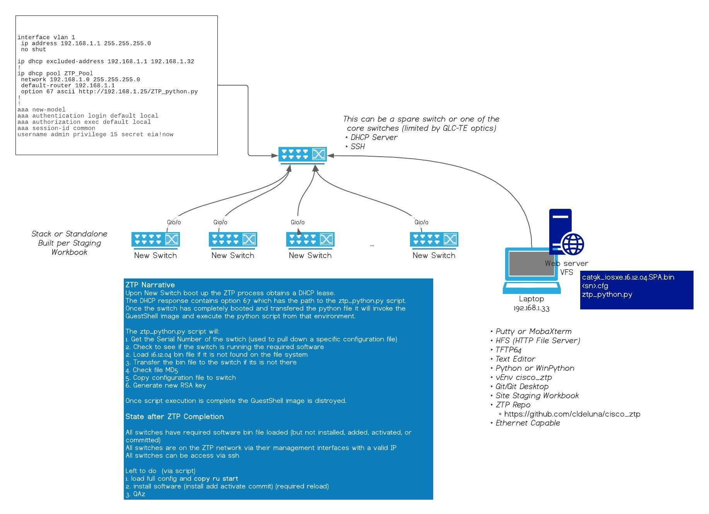
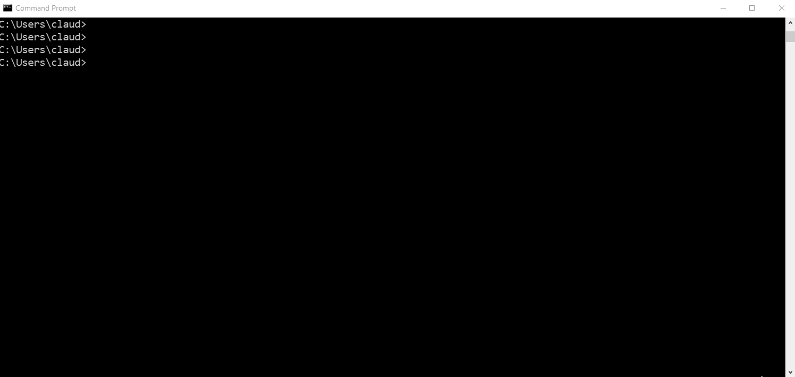

# Cisco Zero Touch Provisioning





This work all started from Jeremy Cohoe's excellent [repository](https://github.com/jeremycohoe/c9300-ztp) and [post](https://blogs.cisco.com/developer/device-provisioning-with-ios-xe-zero-touch-provisioning).


# Getting Started


### Requirements

- [Python3](https://www.python.org/downloads/)
  - Make sure you select the option to update your PATH variable so that you can run python3 from any directory on your laptop.
- [Git](https://git-scm.com/downloads)
  - This may be optional with GitHub Desktop
- [GitHub Desktop](https://desktop.github.com/)
- A good text editor like Atom or Sublime
- [HTTP File Server](https://www.rejetto.com/hfs/)
- (Optional) TFTP Server like [TFTPD64](http://tftpd32.jounin.net/tftpd32_download.html)
- (Optional) IDE like Visual Studio Code or PyCharm


### Define your Virtual Environment

Its a very strong recommendation that you use virtual environments with Python.  A virtual environment is an "instance" of python that has all the modules you need for a given repository.  Over time you will use different repositories and develop ones of your own using different python modules for different things.  Putting all of those modules in your main Python instance will get messy very fast.

I like to establish a specific directory where I keep all of my virtual environments. Typically this is as close to the root directory as feasible so that you work with short paths.   

To invoke or "activate" your virtual environment you need to refer the the exact path of the virtual environment activation file which is why a short path is nice.   An IDE can help with that once you tire of having to use the direct path.


```
python -m venv <name of the directory and virtual env>
```





### Clone this Repository 

##### Clone using git

Requirements:

- git


```
git clone https://github.com/cldeluna/cisco_ztp.git
```


##### Clone using GitHub Desktop

Requirements:

- GitHub Desktop
- GitHub Account


### Install Modules into your Virtual Environment


### Invoke Your Virtual Environment

From your repository


### Tips

ZTP is supported on both management ports and front-panel ports. When a new device is switched on, it retrieves the IP address information of the TFTP/HTTP server where the Python script resides, and the folder path of the Python script. 


## Other Resources


[Devnet Learning Lab](https://developer.cisco.com/learning/lab/LL-ZTP-XE/step/1)

[Automate Device Provisioning with Cisco IOS XE Zero Touch Provisioning](https://blogs.cisco.com/developer/device-provisioning-with-ios-xe-zero-touch-provisioning)

[DevNet ZTP Overview](https://developer.cisco.com/docs/ios-xe/#!zero-touch-provisioning/zero-touch-provisioning)

[Programmability Configuration Guide, Cisco IOS XE Fuji 16.9.x](https://www.cisco.com/c/en/us/td/docs/ios-xml/ios/prog/configuration/169/b_169_programmability_cg/zero_touch_provisioning.html)

[EEM Scripts](https://www.cisco.com/c/en/us/support/docs/ios-nx-os-software/ios-xe-16/216091-best-practices-and-useful-scripts-for-ee.html)


#### cli module help

```python


[guestshell@guestshell ~]$ python
Python 2.7.11 (default, May 17 2017, 05:17:57)
[GCC 5.3.0] on linux2
Type "help", "copyright", "credits" or "license" for more information.
>>> import cli
>>> dir(cli)
['CLICommandError', 'CLIConfigurationError', 'CLIError', 'CLISyntaxError', 'CLITimeoutError', 'ConfigResult', 'Iterable', 'MAX_WAIT_TIME', '_SUPERFLUOUS_CONFIG_LINE', '__builtins__', '__doc__', '__file__', '__name__', '__package__', '__path__', '__version__', 'cli', 'clip', 'configure', 'configurep', 'errors', 'execute', 'executep', 'namedtuple', 'os', 'pnp', 're', 'sys', 'traceback', 'urllib', 'valid']
>>> help(cli)
Help on package cli:

NAME
    cli - Run Cisco IOS CLI commands and receive the output.

FILE
    /usr/lib/python2.7/site-packages/cli/__init__.py

DESCRIPTION
    This module contains utility functions that run Cisco IOS CLI commands and provide
    the output.

PACKAGE CONTENTS
    _test (package)

CLASSES
    ConfigResult(__builtin__.tuple)
        ConfigResult
    exceptions.Exception(exceptions.BaseException)
        CLIError
            CLICommandError
                CLISyntaxError
                CLITimeoutError
            CLIConfigurationError

    class CLICommandError(CLIError)
     |  A base class for exception that are raised when a single command cannot be run in IOS.
     |
     |  Method resolution order:
     |      CLICommandError
     |      CLIError
     |      exceptions.Exception
     |      exceptions.BaseException
     |      __builtin__.object
     |
     |  Methods defined here:
     |
     |  __init__(self, command, message, *args)
     |
     |  ----------------------------------------------------------------------
     |  Data descriptors inherited from CLIError:
     |
     |  __weakref__
     |      list of weak references to the object (if defined)
     |
     |  ----------------------------------------------------------------------
     |  Data and other attributes inherited from exceptions.Exception:
     |
     |  __new__ = <built-in method __new__ of type object>
     |      T.__new__(S, ...) -> a new object with type S, a subtype of T
     |
     |  ----------------------------------------------------------------------
     |  Methods inherited from exceptions.BaseException:
     |
     |  __delattr__(...)
     |      x.__delattr__('name') <==> del x.name
     |
     |  __getattribute__(...)
     |      x.__getattribute__('name') <==> x.name
     |
     |  __getitem__(...)
     |      x.__getitem__(y) <==> x[y]
     |
     |  __getslice__(...)
     |      x.__getslice__(i, j) <==> x[i:j]
     |
     |      Use of negative indices is not supported.
     |
     |  __reduce__(...)
     |
     |  __repr__(...)
     |      x.__repr__() <==> repr(x)
     |
     |  __setattr__(...)
     |      x.__setattr__('name', value) <==> x.name = value
     |
     |  __setstate__(...)
     |
     |  __str__(...)
     |      x.__str__() <==> str(x)
     |
     |  __unicode__(...)
     |
     |  ----------------------------------------------------------------------
     |  Data descriptors inherited from exceptions.BaseException:
     |
     |  __dict__
     |
     |  args
     |
     |  message

    class CLIConfigurationError(CLIError)
     |  Raised when some commands in a bulk configuration fail.
     |
     |  Contains a list of the commands, along with a list of the failures.
     |
     |  Method resolution order:
     |      CLIConfigurationError
     |      CLIError
     |      exceptions.Exception
     |      exceptions.BaseException
     |      __builtin__.object
     |
     |  Methods defined here:
     |
     |  __init__(self, commands, *args)
     |
     |  ----------------------------------------------------------------------
     |  Data descriptors inherited from CLIError:
     |
     |  __weakref__
     |      list of weak references to the object (if defined)
     |
     |  ----------------------------------------------------------------------
     |  Data and other attributes inherited from exceptions.Exception:
     |
     |  __new__ = <built-in method __new__ of type object>
     |      T.__new__(S, ...) -> a new object with type S, a subtype of T
     |
     |  ----------------------------------------------------------------------
     |  Methods inherited from exceptions.BaseException:
     |
     |  __delattr__(...)
     |      x.__delattr__('name') <==> del x.name
     |
     |  __getattribute__(...)
     |      x.__getattribute__('name') <==> x.name
     |
     |  __getitem__(...)
     |      x.__getitem__(y) <==> x[y]
     |
     |  __getslice__(...)
     |      x.__getslice__(i, j) <==> x[i:j]
     |
     |      Use of negative indices is not supported.
     |
     |  __reduce__(...)
     |
     |  __repr__(...)
     |      x.__repr__() <==> repr(x)
     |
     |  __setattr__(...)
     |      x.__setattr__('name', value) <==> x.name = value
     |
     |  __setstate__(...)
     |
     |  __str__(...)
     |      x.__str__() <==> str(x)
     |
     |  __unicode__(...)
     |
     |  ----------------------------------------------------------------------
     |  Data descriptors inherited from exceptions.BaseException:
     |
     |  __dict__
     |
     |  args
     |
     |  message

    class CLIError(exceptions.Exception)
     |  A base class for exceptions that are raised when a CLI cannot be run.
     |
     |  Method resolution order:
     |      CLIError
     |      exceptions.Exception
     |      exceptions.BaseException
     |      __builtin__.object
     |
     |  Data descriptors defined here:
     |
     |  __weakref__
     |      list of weak references to the object (if defined)
     |
     |  ----------------------------------------------------------------------
     |  Methods inherited from exceptions.Exception:
     |
     |  __init__(...)
     |      x.__init__(...) initializes x; see help(type(x)) for signature
     |
     |  ----------------------------------------------------------------------
     |  Data and other attributes inherited from exceptions.Exception:
     |
     |  __new__ = <built-in method __new__ of type object>
     |      T.__new__(S, ...) -> a new object with type S, a subtype of T
     |
     |  ----------------------------------------------------------------------
     |  Methods inherited from exceptions.BaseException:
     |
     |  __delattr__(...)
     |      x.__delattr__('name') <==> del x.name
     |
     |  __getattribute__(...)
     |      x.__getattribute__('name') <==> x.name
     |
     |  __getitem__(...)
     |      x.__getitem__(y) <==> x[y]
     |
     |  __getslice__(...)
     |      x.__getslice__(i, j) <==> x[i:j]
     |
     |      Use of negative indices is not supported.
     |
     |  __reduce__(...)
     |
     |  __repr__(...)
     |      x.__repr__() <==> repr(x)
     |
     |  __setattr__(...)
     |      x.__setattr__('name', value) <==> x.name = value
     |
     |  __setstate__(...)
     |
     |  __str__(...)
     |      x.__str__() <==> str(x)
     |
     |  __unicode__(...)
     |
     |  ----------------------------------------------------------------------
     |  Data descriptors inherited from exceptions.BaseException:
     |
     |  __dict__
     |
     |  args
     |
     |  message

    class CLISyntaxError(CLICommandError)
     |  Raised when there is a syntax error in a command.
     |
     |  Method resolution order:
     |      CLISyntaxError
     |      CLICommandError
     |      CLIError
     |      exceptions.Exception
     |      exceptions.BaseException
     |      __builtin__.object
     |
     |  Methods defined here:
     |
     |  __init__(self, command, *args)
     |
     |  ----------------------------------------------------------------------
     |  Data descriptors inherited from CLIError:
     |
     |  __weakref__
     |      list of weak references to the object (if defined)
     |
     |  ----------------------------------------------------------------------
     |  Data and other attributes inherited from exceptions.Exception:
     |
     |  __new__ = <built-in method __new__ of type object>
     |      T.__new__(S, ...) -> a new object with type S, a subtype of T
     |
     |  ----------------------------------------------------------------------
     |  Methods inherited from exceptions.BaseException:
     |
     |  __delattr__(...)
     |      x.__delattr__('name') <==> del x.name
     |
     |  __getattribute__(...)
     |      x.__getattribute__('name') <==> x.name
     |
     |  __getitem__(...)
     |      x.__getitem__(y) <==> x[y]
     |
     |  __getslice__(...)
     |      x.__getslice__(i, j) <==> x[i:j]
     |
     |      Use of negative indices is not supported.
     |
     |  __reduce__(...)
     |
     |  __repr__(...)
     |      x.__repr__() <==> repr(x)
     |
     |  __setattr__(...)
     |      x.__setattr__('name', value) <==> x.name = value
     |
     |  __setstate__(...)
     |
     |  __str__(...)
     |      x.__str__() <==> str(x)
     |
     |  __unicode__(...)
     |
     |  ----------------------------------------------------------------------
     |  Data descriptors inherited from exceptions.BaseException:
     |
     |  __dict__
     |
     |  args
     |
     |  message

    class CLITimeoutError(CLICommandError)
     |  Raised when a command takes too long to execute.
     |
     |  Method resolution order:
     |      CLITimeoutError
     |      CLICommandError
     |      CLIError
     |      exceptions.Exception
     |      exceptions.BaseException
     |      __builtin__.object
     |
     |  Methods defined here:
     |
     |  __init__(self, command, output, *args)
     |
     |  ----------------------------------------------------------------------
     |  Data descriptors inherited from CLIError:
     |
     |  __weakref__
     |      list of weak references to the object (if defined)
     |
     |  ----------------------------------------------------------------------
     |  Data and other attributes inherited from exceptions.Exception:
     |
     |  __new__ = <built-in method __new__ of type object>
     |      T.__new__(S, ...) -> a new object with type S, a subtype of T
     |
     |  ----------------------------------------------------------------------
     |  Methods inherited from exceptions.BaseException:
     |
     |  __delattr__(...)
     |      x.__delattr__('name') <==> del x.name
     |
     |  __getattribute__(...)
     |      x.__getattribute__('name') <==> x.name
     |
     |  __getitem__(...)
     |      x.__getitem__(y) <==> x[y]
     |
     |  __getslice__(...)
     |      x.__getslice__(i, j) <==> x[i:j]
     |
     |      Use of negative indices is not supported.
     |
     |  __reduce__(...)
     |
     |  __repr__(...)
     |      x.__repr__() <==> repr(x)
     |
     |  __setattr__(...)
     |      x.__setattr__('name', value) <==> x.name = value
     |
     |  __setstate__(...)
     |
     |  __str__(...)
     |      x.__str__() <==> str(x)
     |
     |  __unicode__(...)
     |
     |  ----------------------------------------------------------------------
     |  Data descriptors inherited from exceptions.BaseException:
     |
     |  __dict__
     |
     |  args
     |
     |  message

    class ConfigResult(ConfigResult)
     |  Contains the result of a single line of configuration.
     |
     |  success (bool): True if this line of configuration was configured successfully.
     |  command (str): The configuration command that was run.
     |  notes (str): In the event of an error, this string contains notes about what
     |      went wrong. It is not guaranteed to be the same across platforms.
     |
     |  Method resolution order:
     |      ConfigResult
     |      ConfigResult
     |      __builtin__.tuple
     |      __builtin__.object
     |
     |  Methods defined here:
     |
     |  __str__(self)
     |
     |  ----------------------------------------------------------------------
     |  Data descriptors defined here:
     |
     |  __dict__
     |      dictionary for instance variables (if defined)
     |
     |  ----------------------------------------------------------------------
     |  Methods inherited from ConfigResult:
     |
     |  __getnewargs__(self)
     |      Return self as a plain tuple.  Used by copy and pickle.
     |
     |  __getstate__(self)
     |      Exclude the OrderedDict from pickling
     |
     |  __repr__(self)
     |      Return a nicely formatted representation string
     |
     |  _asdict(self)
     |      Return a new OrderedDict which maps field names to their values
     |
     |  _replace(_self, **kwds)
     |      Return a new ConfigResult object replacing specified fields with new values
     |
     |  ----------------------------------------------------------------------
     |  Class methods inherited from ConfigResult:
     |
     |  _make(cls, iterable, new=<built-in method __new__ of type object>, len=<built-in function len>) from __builtin__.type
     |      Make a new ConfigResult object from a sequence or iterable
     |
     |  ----------------------------------------------------------------------
     |  Static methods inherited from ConfigResult:
     |
     |  __new__(_cls, success, command, line, output, notes)
     |      Create new instance of ConfigResult(success, command, line, output, notes)
     |
     |  ----------------------------------------------------------------------
     |  Data descriptors inherited from ConfigResult:
     |
     |  command
     |      Alias for field number 1
     |
     |  line
     |      Alias for field number 2
     |
     |  notes
     |      Alias for field number 4
     |
     |  output
     |      Alias for field number 3
     |
     |  success
     |      Alias for field number 0
     |
     |  ----------------------------------------------------------------------
     |  Data and other attributes inherited from ConfigResult:
     |
     |  _fields = ('success', 'command', 'line', 'output', 'notes')
     |
     |  ----------------------------------------------------------------------
     |  Methods inherited from __builtin__.tuple:
     |
     |  __add__(...)
     |      x.__add__(y) <==> x+y
     |
     |  __contains__(...)
     |      x.__contains__(y) <==> y in x
     |
     |  __eq__(...)
     |      x.__eq__(y) <==> x==y
     |
     |  __ge__(...)
     |      x.__ge__(y) <==> x>=y
     |
     |  __getattribute__(...)
     |      x.__getattribute__('name') <==> x.name
     |
     |  __getitem__(...)
     |      x.__getitem__(y) <==> x[y]
     |
     |  __getslice__(...)
     |      x.__getslice__(i, j) <==> x[i:j]
     |
     |      Use of negative indices is not supported.
     |
     |  __gt__(...)
     |      x.__gt__(y) <==> x>y
     |
     |  __hash__(...)
     |      x.__hash__() <==> hash(x)
     |
     |  __iter__(...)
     |      x.__iter__() <==> iter(x)
     |
     |  __le__(...)
     |      x.__le__(y) <==> x<=y
     |
     |  __len__(...)
     |      x.__len__() <==> len(x)
     |
     |  __lt__(...)
     |      x.__lt__(y) <==> x<y
     |
     |  __mul__(...)
     |      x.__mul__(n) <==> x*n
     |
     |  __ne__(...)
     |      x.__ne__(y) <==> x!=y
     |
     |  __rmul__(...)
     |      x.__rmul__(n) <==> n*x
     |
     |  count(...)
     |      T.count(value) -> integer -- return number of occurrences of value
     |
     |  index(...)
     |      T.index(value, [start, [stop]]) -> integer -- return first index of value.
     |      Raises ValueError if the value is not present.

FUNCTIONS
    cli(command)
        Execute Cisco IOS CLI command(s) and return the result.

        A single command or a delimited batch of commands may be run. The
        delimiter is a space and a semicolon, " ;". Configuration commands must be
        in fully qualified form.

        output = cli("show version")
        output = cli("show version ; show ip interface brief")
        output = cli("configure terminal ; interface gigabitEthernet 0/0 ; no shutdown")

        Args:
            command (str): The exec or config CLI command(s) to be run.

        Returns:
            string: CLI output for show commands and an empty string for
                configuration commands.

        Raises:
            errors.cli_syntax_error: if the command is not valid.
            errors.cli_exec_error: if the execution of command is not successful.

    clip(command)
        Execute Cisco IOS CLI command(s) and print the result.

        A single command or a delimited batch of commands may be run. The
        delimiter is a space and a semicolon, " ;". Configuration commands must be
        in fully qualified form.

        clip("show version")
        clip("show version ; show ip interface brief")
        clip("configure terminal ; interface gigabitEthernet 0/0 ; no shutdown")

        Args:
            command (str): The exec or config CLI command(s) to be run.

    configure(configuration)
        Apply a configuration (set of Cisco IOS CLI config-mode commands) to the device
        and return a list of results.

        configuration = '''interface gigabitEthernet 0/0
                             no shutdown'''

        # push it through the Cisco IOS CLI.
        try:
            results = cli.configure(configuration)
            print "Success!"
        except CLIConfigurationError as e:
            print "Failed configurations:"
            for failure in e.failed:
                print failure

        Args:
            configuration (str or iterable): Configuration commands, separated by newlines.

        Returns:
            list(ConfigResult): A list of results, one for each line.

        Raises:
            CLISyntaxError: If there is a syntax error in the configuration.

    configurep(configuration)
        Apply a configuration (set of Cisco IOS CLI config-mode commands) to the device
        and prints the result.

        configuration = '''interface gigabitEthernet 0/0
                             no shutdown'''

        # push it through the Cisco IOS CLI.
        configurep(configuration)

        Args:
            configuration (str or iterable): Configuration commands, separated by newlines.

    execute(command)
        Execute Cisco IOS CLI exec-mode command and return the result.

        command_output = execute("show version")

        Args:
            command (str): The exec-mode command to run.

        Returns:
            str: The output of the command.

        Raises:
            CLISyntaxError: If there is a syntax error in the command.

    executep(command)
        Execute Cisco IOS CLI exec-mode command and print the result.

        executep("show version")

        Args:
            command (str): The exec-mode command to run.

    valid(command)
        # validate a command

DATA
    MAX_WAIT_TIME = None
    __version__ = '1.2.0'

VERSION
    1.2.0


>>>
>>>
>>>
>>>
>>>

```